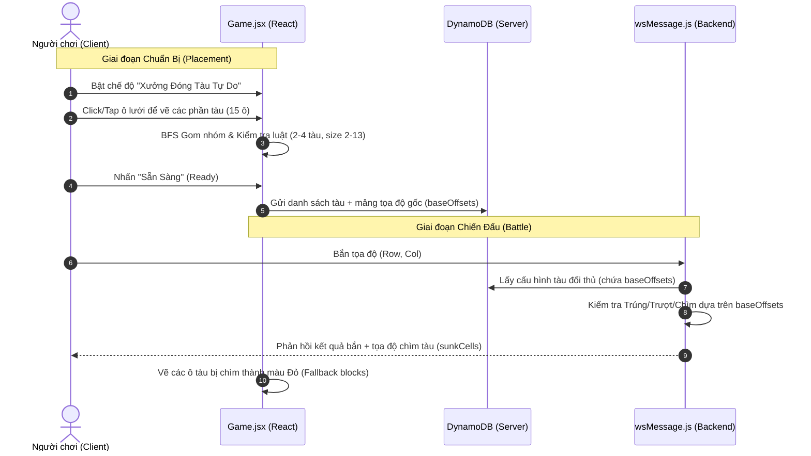

# Kế Hoạch Chi Tiết: Tính Năng Xưởng Đóng Tàu Tự Do (Custom Shipyard)

Kế hoạch này mô tả các thay đổi chi tiết trên cả **Frontend** và **Backend** để triển khai hoàn thiện tính năng **Xưởng Đóng Tàu Tự Do** trong phòng chơi Thường (Casual) hoặc phòng Riêng (Private Room).

---

## 🗺️ Tóm tắt Kiến trúc & Luồng Dữ liệu



---

## 🛠️ Chi Tiết Triển Khai

### 1. Frontend: src/pages/Game.jsx

Chúng ta sẽ thực hiện 6 cập nhật chính trong giao diện và logic dàn trận:

#### A. Khai báo State và biến cờ hiệu
Thêm các biến trạng thái để theo dõi chế độ tự đóng tàu và danh sách các ô do người chơi click chọn:
```javascript
// Game.jsx
const [isCustomShipyardActive, setIsCustomShipyardActive] = useState(false);
```

#### B. Thuật toán Gom Nhóm Liên Kết (BFS) & Kiểm Tra Luật
Thêm hai hàm helper bên trong component `Game` để phân tích lưới vẽ tàu:
*   **`getConnectedComponents(cells)`**: Nhận vào danh sách các ô `{row, col}` đang được chọn, gom nhóm chúng thành các tập hợp tàu liên kết trực giao (ngang/dọc, không tính chéo) bằng thuật toán BFS.
*   **`toggleCustomShipyardCell(r, c)`**: 
    1.  Cập nhật trạng thái ô vừa chọn.
    2.  Chạy `getConnectedComponents` để gom nhóm các con tàu.
    3.  Kiểm tra điều kiện:
        *   Tổng số ô linh kiện = 15.
        *   Số lượng tàu = 2 đến 4 tàu.
        *   Kích thước mỗi tàu = 2 đến 13 ô.
    4.  Nếu **hợp lệ**, cập nhật `playerBoard` với thông tin chi tiết (`shipId`, `shipTypeId`, `shipLength`, `shipRoot`, `shipBounds`) và set `unplacedShipIds = []` (Mở khóa nút Sẵn Sàng).
    5.  Nếu **chưa hợp lệ**, set `unplacedShipIds = ['custom-invalid']` để khóa nút Sẵn Sàng và hiển thị hướng dẫn thiếu/thừa ô.

#### C. Chỉnh sửa Hành Vi Click/Touch trên lưới
Trong các hàm bắt sự kiện click/tap trên lưới bên phe mình (`handlePlayerCellClick` cho desktop, `handleTouchStart` cho mobile), chèn nhánh xử lý riêng nếu chế độ tự đóng tàu đang bật:
```javascript
// Nếu chế độ xưởng đóng tàu đang bật, bỏ qua kéo thả mặc định và chỉ toggle ô vẽ tàu
if (isCustomShipyardActive) {
  toggleCustomShipyardCell(r, c);
  return;
}
```

#### D. Giao diện Bảng Điều Khiển (Deployment Dock Panel)
Khi `isCustomShipyardActive = true`, ẩn danh sách các con tàu mẫu tiêu chuẩn và hiển thị thông tin xưởng đóng tàu:
*   Số lượng ô linh kiện đã vẽ: `X / 15` (chữ màu xanh neon nếu đủ 15, màu vàng cảnh báo nếu thiếu/thừa).
*   Số tàu phát hiện được từ thuật toán gom nhóm.
*   Các cảnh báo vi phạm quy tắc (nếu có) như: *"Số lượng tàu phải từ 2-4"* hoặc *"Có tàu kích thước sai quy định"*.
*   Nút bật/tắt chế độ để người chơi dễ dàng quay lại cách chơi truyền thống nếu muốn.

#### E. Thay Đổi Cấu Trúc Gửi Board Lên Server (`beginBattle`)
Khi người chơi nhấn Sẵn Sàng, tính toán mảng tọa độ tương đối (`baseOffsets`) cho từng tàu dựa trên các ô thuộc về nó, rồi đính kèm vào payload gửi lên server:
```javascript
const board = {
  placedAt: new Date().toISOString(),
  ships: playerBoard
    .flat()
    .filter((cell) => cell.shipRoot)
    .map((cell) => {
      // Tìm tất cả các ô thuộc tàu này để tính baseOffsets
      const shipCells = playerBoard.flat().filter(c => c.shipId === cell.shipId);
      const minRow = Math.min(...shipCells.map(c => c.row));
      const minCol = Math.min(...shipCells.map(c => c.col));
      const baseOffsets = shipCells.map(c => [c.row - minRow, c.col - minCol]);
      return {
        shipId: cell.shipId,
        shipTypeId: cell.shipTypeId,
        row: minRow,
        col: minCol,
        rotation: 0,
        baseOffsets, // Đính kèm tọa độ hình dạng tàu để server xử lý bắn
      };
    }),
};
```

#### F. Hiển Thị Hình Dạng Tàu Tự Vẽ Khi Bị Chìm
Tận dụng cơ chế render fallback sẵn có trong `renderBoard` của dự án khi không tìm thấy sprite ảnh của tàu chuẩn. Điều chỉnh màu sắc hiển thị các ô khối vuông này thành màu đỏ tối để biểu thị trạng thái đã chìm:
```javascript
// Trong hàm renderBoard, khu vực render fallback
getFallbackShipCells(board, cell.shipId).map((shipCell) => (
  <div
    key={`${cell.shipId}-${shipCell.row}-${shipCell.col}`}
    className={`absolute border ${
      isShipSunk 
        ? "bg-error/30 border-error/50" // Đỏ khi chìm
        : "bg-secondary/30 border-secondary/40" // Xanh neon khi bình thường
    }`}
    style={{
      left: `calc(${shipCell.col - (cell.shipOriginCol ?? cell.col)} * (var(--cell-size) + var(--cell-gap)))`,
      top: `calc(${shipCell.row - (cell.shipOriginRow ?? cell.row)} * (var(--cell-size) + var(--cell-gap)))`,
      width: `var(--cell-size)`,
      height: `var(--cell-size)`,
    }}
  />
))
```

---

### 2. Backend: BackEnd/src/handlers/wsMessage.js

Chúng ta cần nâng cấp hàm tính toán ô chiếm dụng của tàu (`getOccupiedCells`) để tự động hỗ trợ mảng tọa độ tùy biến từ client:

```javascript
const getOccupiedCells = (ships) => {
  const occupied = [];
  for (const ship of ships) {
    // Nếu tàu gửi lên có sẵn baseOffsets (từ xưởng đóng tàu tùy biến)
    if (ship.baseOffsets && Array.isArray(ship.baseOffsets)) {
      for (const [dr, dc] of ship.baseOffsets) {
        occupied.push({
          row: ship.row + dr,
          col: ship.col + dc,
          shipId: ship.shipId,
          shipTypeId: ship.shipTypeId,
          shipLength: ship.baseOffsets.length
        });
      }
    } else {
      // Trường hợp tàu chuẩn truyền thống, tra cứu từ hệ thống mẫu cũ
      const shipDef = SHIP_DEFS.find(d => d.id === ship.shipTypeId);
      if (!shipDef) continue;
      const offsets = getShipOffsets(shipDef, ship.rotation);
      for (const [dr, dc] of offsets) {
        occupied.push({
          row: ship.row + dr,
          col: ship.col + dc,
          shipId: ship.shipId,
          shipTypeId: ship.shipTypeId,
          shipLength: shipDef.size
        });
      }
    }
  }
  return occupied;
};
```

---

## 🛡️ Rủi Ro & Giải Pháp Tối Ưu Hóa

1.  **Chống Gian Lận (Cheating):** Do server chấp nhận cấu hình tàu trực tiếp từ client thông qua `markPlayerReady`, một người chơi gian lận có thể gửi gói tin sửa đổi chứa nhiều hơn 15 ô hoặc kích thước tàu sai lệch.
    *   *Giải pháp:* Tính năng này đang ở giai đoạn Beta hạn chế trong Đấu Thường (Casual) và Phòng Riêng (Private Room) để thử nghiệm tính ổn định của luồng vẽ tàu. Sau này, ta có thể tích hợp thuật toán BFS gom nhóm này lên server để kiểm chứng lại một lần nữa trước khi cập nhật cơ sở dữ liệu.
2.  **Độ Phản Hồi Mobile:** Cử chỉ click/tap nhanh có thể bị hiểu nhầm thành thao tác cuộn trang hoặc zoom trên điện thoại.
    *   *Giải pháp:* Sử dụng thuộc tính CSS `touch-action: none` trên container của lưới bàn cờ khi chế độ vẽ tàu đang kích hoạt nhằm chặn hoàn toàn các chuyển động cuộn mặc định của trình duyệt.
