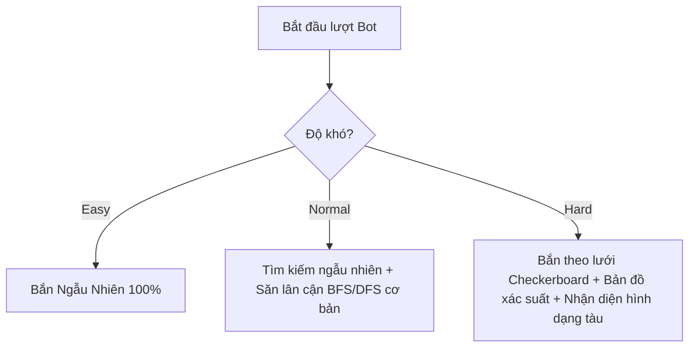

# Kế hoạch điều chỉnh Bot AI chế độ PvE (Battleship Arena)

Tài liệu này đề xuất kế hoạch chi tiết để nâng cấp cơ chế hoạt động của Bot AI trong chế độ PvE (Player vs Environment). Kế hoạch tập trung hoàn toàn vào việc phân chia hành vi của Bot theo 3 cấp độ khó (**Easy**, **Normal**, **Hard**), cải tiến thuật toán xếp tàu và thuật toán bắn để thích ứng với các hình dạng tàu phi tuyến tính mới (Ziczac, Chữ T, L, v.v.) mà không làm ảnh hưởng đến logic của PvP.

---

## 1. Phân tích Hiện trạng & Vấn đề của Bot AI cũ

- **Tệp tin liên quan:** `FrontEnd/src/game/botAI.js`
- **Hạn chế của logic cũ:**
  - Logic cũ (`updateBotState`) giả định tất cả các tàu đều là **đường thẳng** (ngang hoặc dọc). Khi bắn trúng 2 ô, Bot sẽ khóa hướng bắn (`state.direction = 'HORIZONTAL'` hoặc `'VERTICAL'`) và chỉ bắn theo hướng đó cho đến khi tàu chìm.
  - Khi đối mặt với các tàu có hình dạng phức tạp (như tàu Ziczac `zship`, tàu Chữ T `gunboat`, tàu Lancer `lancer`...), việc khóa hướng dọc/ngang sẽ khiến Bot bắn trượt xung quanh và không thể tiêu diệt hoàn toàn tàu địch một cách hiệu quả, dẫn đến vòng lặp bắn vô tận hoặc xử lý rất chậm.
  - Chưa phân chia rõ ràng cơ chế xếp tàu (Placement) giữa các chế độ: Bot luôn dùng chung hàm `placeShipsRandomly` với danh sách tàu của người chơi, chưa giới hạn tính năng Shipyard đối với Easy/Normal.

---

## 2. Thiết kế chi tiết theo 3 Cấp độ Khó



### 2.1. Cấp độ Dễ (Easy)

* **Cơ chế Xếp tàu (Placement):**
  - **Quy tắc:** Chỉ được xếp các loại tàu tiêu chuẩn có sẵn (`SHIP_DEFS` cơ bản). **Không** được phép sử dụng chế độ tự thiết kế tàu (Shipyard).
  - **Giải pháp:** Nếu người chơi chơi ở chế độ Custom Shipyard, Bot Easy sẽ tự động tạo một đội tàu hợp lệ từ danh sách `SHIP_DEFS` có sẵn (sử dụng hàm chọn lọc ngẫu nhiên các tàu sao cho tổng số cell = 15).
* **Cơ chế Chiến đấu (Battle):**
  - **Thuật toán bắn:** Ngẫu nhiên 100% trên các ô chưa bắn (sử dụng hàm `getEasyMove`).
  - **Trạng thái:** Bot không lưu trữ trạng thái (`state.mode = 'HUNT'`), không ghi nhớ các ô đã bắn trúng (Hit) để bao vây bắn tiếp.

### 2.2. Cấp độ Trung bình (Normal)

* **Cơ chế Xếp tàu (Placement):**
  - Giống Easy: Chỉ xếp tàu có sẵn từ `SHIP_DEFS` mặc định, **không** dùng Shipyard.
* **Cơ chế Chiến đấu (Battle):**
  - **Chế độ Tìm kiếm (Hunt Mode):** Bắn ngẫu nhiên vào các ô chưa bắn.
  - **Chế độ Tiêu diệt (Target Mode):** 
    - Khi bắn trúng (Hit), Bot sẽ chuyển sang `Target Mode` và đẩy 4 ô lân cận (Trên, Dưới, Trái, Phải) vào một danh sách hàng đợi (Queue/Stack).
    - **Cải tiến thông minh:** **Không khóa hướng bắn cố định (Không dùng Horizontal/Vertical)**. Thay vào đó, mỗi khi bắn trúng thêm một ô mới của cùng một tàu, Bot tiếp tục bổ sung các ô lân cận của ô đó vào hàng đợi. Điều này tạo ra một thuật toán loang (Flood Fill/BFS) giúp Bot Normal dễ dàng quét sạch toàn bộ con tàu dù nó có hình chữ T, Ziczac hay hình dạng kỳ lạ nào khác mà không bị kẹt.
    - Khi tàu bị chìm (`isSunk === true`), Bot reset trạng thái và quay về `Hunt Mode`.

### 2.3. Cấp độ Khó (Hard)

* **Cơ chế Xếp tàu (Placement):**
  - **Quy tắc:** Được phép sử dụng chế độ Shipyard.
  - **Giải pháp:**
    - Bot sẽ tự sinh ngẫu nhiên một bố cục tàu Shipyard hợp lệ (tổng 15 ô, số tàu từ 2-4, kích thước mỗi tàu từ 2-13 ô) bằng thuật toán Random Walk trên lưới 10x10.
    - Hoặc Bot sẽ chọn ngẫu nhiên 1 trong 10 mẫu thiết kế Shipyard độc đáo được định nghĩa sẵn trong code để đảm bảo độ hiểm hóc.
* **Cơ chế Chiến đấu (Battle - Chơi có chiều sâu):**
  - **Săn theo lưới (Checkerboard/Parity Search):**
    - Khi ở `Hunt Mode`, thay vì bắn ngẫu nhiên, Bot chỉ bắn vào các ô có tọa độ `(row + col) % 2 === 0` (mô hình bàn cờ). Do kích thước tàu tối thiểu là 2, mọi con tàu đều phải đè lên ít nhất một ô bàn cờ. Việc này giúp giảm 50% số lượt bắn cần thiết để tìm ra tàu.
  - **Bản đồ xác suất (Probability Map):**
    - Bot sẽ tính toán xác suất cho từng ô trên bàn cờ dựa trên danh sách các tàu chưa bị chìm của đối phương.
    - Với mỗi ô chưa bắn, Bot giả lập tất cả các cách đặt của các tàu còn lại (xoay 4 hướng, dịch chuyển vị trí). Ô nào có số cách đặt đè lên nhiều nhất sẽ có điểm xác suất cao nhất và được ưu tiên bắn trước.
  - **Nhận diện hình dạng tàu & Dự đoán vị trí (Shape Recognition):**
    - Khi bắn trúng từ 2 ô trở lên của một tàu chưa chìm, Bot sẽ lọc danh sách các tàu địch còn sống để xem tàu nào có hình dạng khớp với cấu hình các ô đã Hit.
    - Ví dụ: Nếu đã bắn trúng 3 ô tạo thành góc vuông, Bot sẽ đối chiếu xem đối phương còn tàu chữ T (`gunboat`) hay tàu Lancer không. Bot sẽ tính toán các ô tiếp theo dựa trên hình dạng thực tế của các tàu đó để bắn chính xác phần còn lại, chứ không rà soát mù quáng.
  - **Tối ưu hóa Vùng loại trừ (Exclusion Zones):**
    - Ngay khi một tàu địch bị đánh chìm, Bot sẽ đánh dấu toàn bộ các ô xung quanh con tàu đó (vùng đệm) là Miss/Không bắn, vì quy tắc game không cho phép các tàu đặt sát cạnh nhau. Điều này giúp thu hẹp đáng kể không gian tìm kiếm các tàu khác.

---

## 3. Kế hoạch Các bước Chỉnh sửa File Code (Implementation Plan)

### Bước 1: Cập nhật cấu trúc trạng thái Bot (`botAI.js`)
Tách biệt trạng thái của Bot Normal và Bot Hard để tránh xung đột dữ liệu:
```javascript
// Cấu trúc state mới đề xuất
let botState = {
    difficulty: 'easy',
    mode: 'HUNT', // HUNT, TARGET
    targetQueue: [], // Hàng đợi bắn cho Normal Bot (BFS)
    hitCells: [], // Danh sách các ô đã bắn trúng của tàu hiện tại (dành cho Hard Bot suy luận hình dạng)
    sunkShipIds: [],
};
```

### Bước 2: Viết thuật toán Loang (BFS/DFS) cho Normal Bot
Loại bỏ logic khóa hướng `state.direction` trong `updateBotState` đối với Normal Bot. Chỉ cần đẩy các ô kề cạnh vào `targetQueue` khi bắn trúng:
```javascript
function updateNormalBotState(board, move, result) {
    if (result.result === 'HIT') {
        if (result.isSunk) {
            botState.targetQueue = [];
            botState.mode = 'HUNT';
        } else {
            botState.mode = 'TARGET';
            // Thêm các ô xung quanh ô vừa trúng vào Queue
            addAdjacentToQueue(board, move.row, move.col);
        }
    }
}
```

### Bước 3: Triển khai Logic Nhận dạng Hình dạng và Bản đồ Xác suất cho Hard Bot
1. **Hàm giả lập đặt tàu (`canFitShipShape`)**: Nhận vào một hình dạng tàu (baseOffsets), một tọa độ và kiểm tra xem tàu đó có thể đặt đè lên các điểm đã Hit và không đè lên các điểm đã Miss hay không.
2. **Hàm tính xác suất (`calculateProbabilityMap`)**: 
   - Duyệt qua tất cả các tàu chưa chìm của người chơi.
   - Với mỗi tàu, thử đặt ở mọi vị trí và hướng trên bàn cờ.
   - Tăng điểm của các ô tương ứng nếu vị trí đặt đó là hợp lệ và khớp với các điểm đã Hit.
   - Chọn ô có điểm cao nhất để bắn.

### Bước 4: Điều chỉnh Cơ chế Khởi tạo Bàn cờ Bot (Placement) trong `Game.jsx`
Khi khởi động trận đấu PvE:
- Đọc giá trị `difficulty` từ URL params.
- Nếu `difficulty` là `'easy'` hoặc `'normal'`:
  - Chọn ngẫu nhiên một bộ tàu từ danh sách `getLegalFleetSelections(SHIP_DEFS)`.
  - Gọi `placeShipsRandomly(newEnemyBoard, selectedFleet)`.
- Nếu `difficulty` là `'hard'`:
  - Nếu người chơi sử dụng Custom Shipyard: Bot Hard được phép sinh đội hình Shipyard ngẫu nhiên hoặc từ template thiết kế phức tạp có sẵn.
  - Đặt tàu lên bàn cờ của Bot.

---

## 4. Kế hoạch Kiểm thử & Cân bằng (Testing & Balancing)

1. **Unit Test Thuật toán Nhận diện:** 
   - Giả lập một bàn cờ người chơi có tàu chữ T (`gunboat`) và tàu Ziczac (`zship`).
   - Giả lập lượt bắn của Bot Hard sau khi trúng 1 ô, 2 ô để kiểm tra xem tọa độ bắn tiếp theo có khớp với hình dáng tàu hay không.
2. **Kiểm thử Tự động (Simulation Play):**
   - Chạy 100 trận đấu tự động giữa Bot Easy vs Bot Normal, Bot Normal vs Bot Hard.
   - Thu thập thống kê số lượt bắn trung bình để đánh chìm toàn bộ hạm đội:
     - **Easy Bot:** ~70-90 lượt (do bắn ngẫu nhiên hoàn toàn).
     - **Normal Bot:** ~45-60 lượt (do săn lân cận hiệu quả).
     - **Hard Bot:** ~30-45 lượt (do quét lưới checkerboard và đoán hình dạng tàu tối ưu).
3. **Đánh giá Trải nghiệm Người chơi (UX):**
   - Đảm bảo thời gian suy nghĩ của Bot Hard khi tính toán bản đồ xác suất không quá lâu (tối ưu hóa thuật toán chạy dưới 150ms để tránh giật lag UI).
